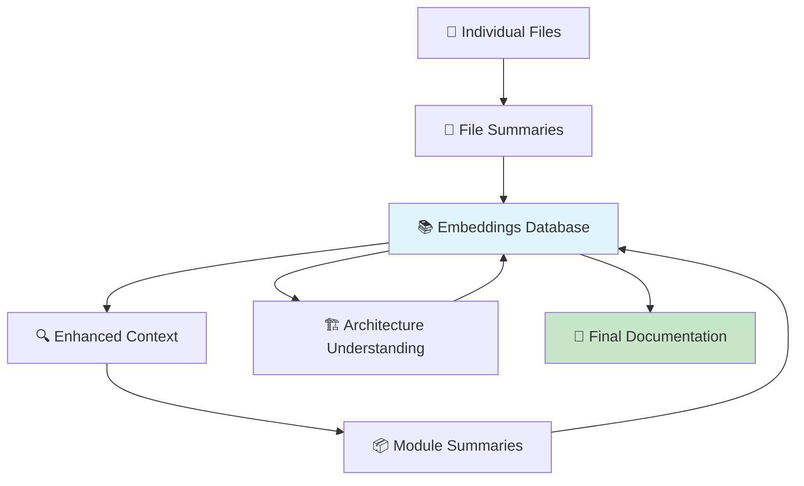

# 🌟 ConductDoc: Recursive AI Documentation Generator

```
     ╭─────────────────────────────────────────────────╮
     │  🔄 RECURSIVE KNOWLEDGE SYNTHESIS PIPELINE     │
     ╰─────────────────────────────────────────────────╯
                            │
        ┌─────────────────────▼─────────────────────┐
        │          📁 Repository Analysis           │
        │     🕷️ Crawl → 🧠 Analyze → 📝 Generate    │
        └─────────────────────┬─────────────────────┘
                            │
     ╭─────────────────────────▼─────────────────────────╮
     │  🌳 RECURSIVE SUMMARIZATION STRATEGY             │
     │                                                  │
     │  Files → Modules → Packages → Architecture       │
     │    ↓        ↓         ↓           ↓             │
     │  Each summary enriches the embeddings database   │
     │  Creating a self-reinforcing knowledge web 🕸️   │
     ╰──────────────────────────────────────────────────╯
```

**An AI-powered documentation generator that creates living, breathing documentation through recursive knowledge synthesis.**

---

## ✨ What Makes ConductDoc Special

### 🔄 The Recursive Intelligence Engine

ConductDoc doesn't just analyze code—it **builds understanding recursively**, creating a self-enriching knowledge ecosystem:



### 🌱 Self-Enriching Knowledge Web

1. **Bottom-Up Understanding**: Starts with individual files and builds toward architectural comprehension
2. **Recursive Feedback**: Each generated summary feeds back into the embeddings database
3. **Context Amplification**: Later analyses benefit from all previous insights
4. **Dual Summarization**: Generates both concise abstracts and detailed explanations

---

## 🚀 The Magic in Action

### Phase 1: 🕷️ **Intelligent Crawling**
```python
# Discovers source structure automatically
src_path = find_source_directory(repo_path)
docs_path = find_docs_directory(repo_path)

# Builds comprehensive code understanding
elements, import_graph, ast_map = crawl_source_code(src_path)
```

### Phase 2: 🧠 **Recursive Analysis with RAG**
```python
# The secret sauce: Recursive summarization that enriches itself
def generate_recursive_summary(elements, retriever, readme_content):
    # 1. Build file-level summaries
    for file_path, elements_in_file in grouped_elements:
        abstractive_summary = ai_summarize_file(file_path, context)
        detailed_summary = ai_detailed_analysis(file_path, context)
        
        # 🔥 KEY: Feed summary back into retrieval system
        retriever.add_chunks([f"AI Summary: {abstractive_summary}"])
    
    # 2. Build module-level understanding (now enriched with file summaries)
    for module_path in modules:
        module_summary = ai_summarize_module(module_path, enhanced_context)
        retriever.add_chunks([f"Module Summary: {module_summary}"])
    
    # 3. Build architectural understanding (enriched with everything)
    final_summary = ai_architectural_analysis(all_enriched_context)
```

### Phase 3: 📝 **Beautiful Generation**
```python
# Creates stunning interactive documentation
create_documentation_file(analysis_result, all_elements_with_docs)
```

---

## 🎨 What You Get: Living Documentation

### 🏠 **Interactive Architecture Diagrams**
- **D3.js powered** tree visualizations
- **Hover tooltips** with AI-generated summaries
- **Collapsible nodes** for exploration
- **Zoom and pan** for large codebases

### 📖 **Intelligent Content Structure**
- **Executive Summary**: High-level overview for stakeholders
- **Interactive Architecture**: Visual code exploration
- **Code Examples**: AI-curated, ready-to-run snippets
- **API Reference**: Complete documentation with context

### ⚡ **Performance Optimized**
- **Intelligent Caching**: LLM responses cached by content hash
- **Deterministic Operations**: Consistent results across runs
- **Incremental Updates**: Only re-analyzes changed components

---

## 🔧 Quick Start

### 1. **Setup**
```bash
# Clone and install
git clone <repository-url>
cd ConductAI
pip install -r requirements.txt

# Configure your LLM (OpenRouter recommended)
echo "OPENROUTER_API_KEY=your_key_here" > .env
```

### 2. **Generate Documentation**
```bash
# Analyze any Python repository
python main.py --repo-url https://github.com/ManimCommunity/manim.git --llm-mode openrouter

# Or use local Ollama
python main.py --repo-url https://github.com/your/repo.git --llm-mode local
```

### 3. **Explore the Results**
```bash
# Open the beautiful documentation
open output/documentation.html
```

---

## 🏗️ Architecture: The Recursive Engine

```
┌─────────────────────────────────────────────────────────────┐
│                    🧠 RECURSIVE RAG PIPELINE                │
├─────────────────────────────────────────────────────────────┤
│                                                             │
│  📁 Repository                                              │
│    ├── 🔍 AST Analysis                                      │
│    ├── 📊 Import Graph                                      │
│    └── 📚 Existing Docs                                     │
│                     │                                       │
│                     ▼                                       │
│  🗄️ Embeddings Database ←──────────────────────┐           │
│    ├── Original documentation                   │           │
│    ├── Code structure                          │           │
│    ├── README context                          │           │
│    └── Generated summaries (recursive!) ───────┘           │
│                     │                                       │
│                     ▼                                       │
│  🔄 Recursive Summarization                                 │
│    ├── 📄 File Analysis    → Enhanced Context              │
│    ├── 📦 Module Synthesis → More Enhanced Context         │
│    ├── 🏗️ Architecture     → Fully Enhanced Context       │
│    └── 💎 Final Documentation                              │
│                                                             │
└─────────────────────────────────────────────────────────────┘
```

### 🧩 Core Components

| Component | Purpose | Magic |
|-----------|---------|-------|
| **🕷️ Crawler** | Repository analysis | AST parsing, import tracking, doc ingestion |
| **🧠 Analyzer** | Recursive RAG engine | Self-enriching embeddings, dual summarization |
| **📝 Generator** | Beautiful HTML creation | D3.js diagrams, responsive design, copy buttons |
| **⚡ Retriever** | Semantic search | Vector embeddings, context enhancement |
| **💾 Cache** | Performance optimization | Content-based caching, deterministic keys |

---

## 🎯 The Recursive Advantage

### 🔄 **Self-Reinforcing Knowledge**
Each analysis phase enriches the knowledge base for subsequent phases:

1. **File summaries** help understand modules
2. **Module summaries** help understand architecture  
3. **Architectural insights** help generate examples
4. **Everything together** creates coherent, contextual documentation

### 🎨 **Context-Aware Generation**
Unlike traditional documentation generators, ConductDoc understands:
- **Intent**: What the code is trying to achieve
- **Relationships**: How components work together
- **Patterns**: Common usage scenarios
- **Evolution**: How the codebase is structured and why

### ⚡ **Smart Caching**
The caching system ensures:
- **Consistency**: Identical inputs always produce identical outputs
- **Speed**: Subsequent runs are lightning fast
- **Efficiency**: Only changed content is re-analyzed

---

## 🌟 Advanced Features

### 🎛️ **Flexible Configuration**
```bash
# Use different LLM providers
python main.py --repo-url <repo> --llm-mode openrouter
python main.py --repo-url <repo> --llm-mode local

# Override auto-detection
python main.py --repo-url <repo> --src-dir custom/source --docs-dir docs/

# Debug and optimize
python main.py --repo-url <repo> --save-debug-data --clear-cache
```

### 🔍 **Debug Mode**
```bash
# Saves intermediate data for analysis
python main.py --repo-url <repo> --save-debug-data

# Generates:
# .temp/debug_import_graph.json     - Code dependencies
# .temp/debug_module_map.json       - Module structure  
# .temp/debug_docs_context.html     - Processed documentation
```

### ⚡ **Performance Options**
```bash
# Clear LLM cache for fresh analysis
python main.py --repo-url <repo> --clear-cache

# Cache directory: .cache/
# Each response cached by content hash for consistency
```

---

## 🔮 Future Vision

### 🧠 **Enhanced Intelligence**
- **Multi-language support**: Beyond Python to JavaScript, TypeScript, Go
- **Cross-repository analysis**: Understanding dependencies and relationships
- **Evolutionary documentation**: Tracking how codebases change over time

### 🎯 **Advanced Features**
- **Interactive Q&A**: Natural language queries about the codebase
- **Code quality insights**: Automated suggestions for improvements
- **Documentation validation**: Detecting outdated or incorrect documentation

### 🌐 **Integration Ecosystem**
- **IDE extensions**: Real-time documentation in your editor
- **CI/CD integration**: Automated documentation updates
- **Team collaboration**: Shared understanding across development teams

---

## 🎨 Sample Output

The generated documentation includes:

### 📊 **Interactive Architecture Diagram**
A beautiful D3.js visualization showing:
- 📁 **Directory structure** with collapsible nodes
- 🐍 **Python modules** with type indicators
- 📄 **Configuration files** with distinct styling
- 💬 **Hover tooltips** with AI-generated summaries

### 📚 **Comprehensive Content**
- **Executive Overview**: Perfect for stakeholders and new team members
- **Code Examples**: Curated, runnable examples for common tasks
- **API Reference**: Complete documentation with source code
- **Navigation**: Smooth scrolling, sticky navigation, responsive design

---

## 🤝 Contributing

This project demonstrates the power of recursive AI analysis for code understanding. The architecture is designed for:

- **🔧 Extensibility**: Easy to add new analysis types
- **🧪 Testability**: Clear separation of concerns
- **📈 Scalability**: Efficient caching and incremental updates
- **🎨 Beauty**: Modern, responsive, interactive output

---

## 📄 License

MIT License - Feel free to use this as inspiration for your own documentation automation projects!

---

*Built with ❤️ and recursive intelligence - where each analysis makes the next one smarter.*